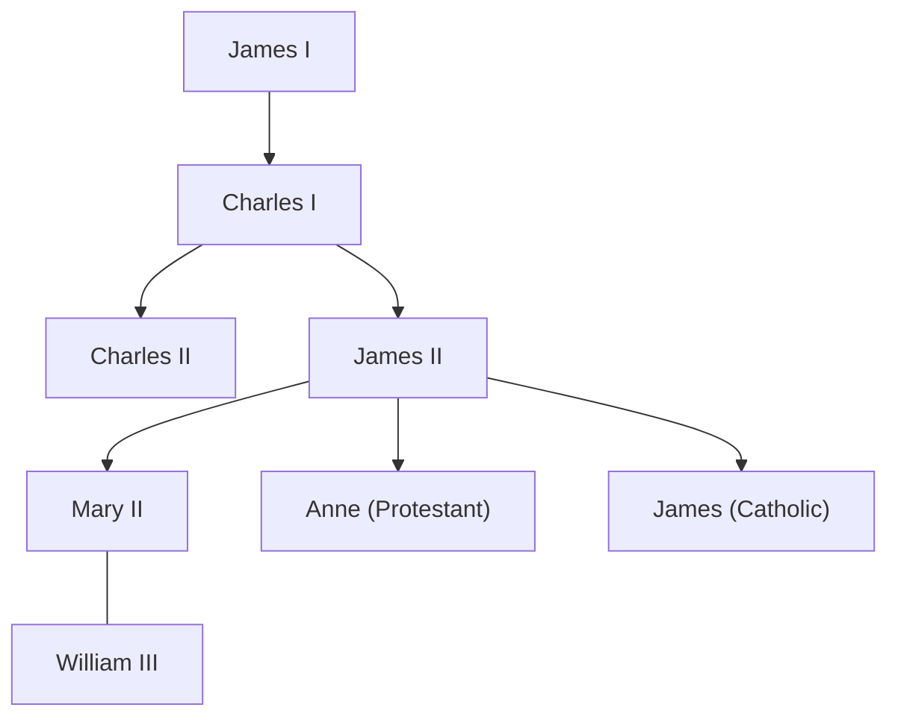

## England in the 17th Century
- English turns from [[cards/Absolutism]] to [[cards/Constitutionalism]] by end of 17th Century
	- absolutist states -> soveriegnty resides with the monarch
	- constitutionalist states -> sovereignty resides with the parliament
- No more [[Tudor|Tudor dynasty]] after 1603 ([[Elizabeth I]] dies)
- "Virgin Queen"... no progeny, but many suitors, (not a virgin)
- Distant cousins... from Scotland, succeeded ruling line
- [[Stuart|The Stuart dynasty]]
- [[cards/James I]] (r.1603-1625)
	- James IV of Scotland before 1603
	- Made fun of for accent; wasn't English
	1. Promoted divine right
	2. "Fancied" [[cards/Absolutism]]
	- Parliament disagreed with these ideas, "friction between factions"
	- Magna Carata in 1215 gave Parliament power
	- Conflict between monarch and parliament, sovereignty struggle, motif
## Parliament v. James I
- [[cards/James I]]
	- Ostracized many very quickly
	- Parliament & Catholics both disliked him
	- [[cards/Gunpowder Plot]]
		- Guy Fawkes tried to blow-up Parliament
		- November 5, 1605
		- Perceived perscution of Catholics
		- Ratted out, tried, ... drawn & quartered
	- tried to raise taxes and fund war without Parliament
	- Parliament demanded consent for taxation, hindering James
	- Circumvented Parliament by selling "titles"
		- Viscount 10k pounds, Earl 20k pounds
		- upset "old money" parliament members vs "new money" merchants
		- health issues, short lifespan + rule from inbreeding
		- died of violenet dysentery
- [[cards/Charles I]]
	- the son of [[cards/James I]], more controversial than father
	- quickly reached a boiling point
	- Parliament challenged him, passing the [[cards/Petition of Right]] (1628)
		- Parliament consent for TYW funding & taxation
		- dissolves Parliament in 1629
		- `"Personal rule"` for 11 years
	- 1640 "Scotland Issue", needed money
	- [[cards/Bishops Wars|Bishops' Wars]] 1639-1640, Parliament reconvened out of neccessity in 1640
	- The Long Parliament (1640-1660)
		- pass the [[cards/Triennial Acts]] :: meet at least every 3 years
		- angers Charles, Parliament forms a militia
## The English Civil War
- [[cards/English Civil War]]
	- Parliament's militia -> "New Model Army" (Roundheads)
	- led by [[cards/Oliver Cromwell]], and fought [[cards/Charles I]]'s army, Loyalists (Cavaliers)
	- 1649, Charles is arrested and "tried", decapitated
	- [[The Interregnum]] (1649 - 1660)
		- means `between monarchs`
		- [[cards/Oliver Cromwell]] called "Lord Protector"
		- similar to [[Robespierre]]
		- verge of another civil war, but died of natural causes in 1658
	- 1661 - Parliament exhumed Cromwell; posthumously hanged & decapitated; head left on a pike for years.
	- The Restoration (1660), [[cards/Charles II]]
		- restores the [[Stuart]] monarchy, instating [[cards/Charles II]]
		- "decent & amiable", respected Parliament
		- 1660s was a very tumultuous time (he was oblivious)
		- plague outbreak in 1666 (again) London
		- "The Great Fire" of London (1666)
- [[cards/Charles II]]
	- Liked to party, hedonism
	- wife, [[Catherine of Braganza]] made tea popular
	- patron of the arts + sciences
		- founded + funded the "Royal Observatory"
	- [[The Royal Society]], funded fellows (commissioned by government)
		- [[Robert Boyle]], [[Isaac Newton]]
	- ran into issue of [[primogeniture]] :: had no legitmate male heirs
		- 13 mistresses, 12+ bastards, cannot rule
		- after death, his younger brother [[cards/James II]] (Duke of York) became king
			- Parliament feared his ascendancy
			- hardcore **Catholic** & **absolutist**
	- died of natural causes
- [[cards/James II]] (r. 1685-1688)
	- infuriated Parliament by replacing all Protestant with Catholics
	- 2 Protestant daughters, Mary + Anne; Parliament fears placated
	- allegedly had a son in June 1688
	- conspiracy theories
		1. was actually stillborn
		2. smuggled in another baby ?, "warming pan" myth
	- [[The Glorious Revolution]] (1688)
		- Parliament contacts Mary, ruling Netherlands with her husband [[William III]]
		- landed an Dutch army at Torbay, UK
		- James had no supporters, fled to France with "infant son"
		- protection of his cousin [[Louis XIV]]

## The Glorious Revolution (1688)
- [[The Glorious Revolution]]
	- Parliament sought **balanced government** with William and Mary
	- Codified in a document
	- [[The English Bill of Rights (1689)]]
		- Influenced by [[John Locke]]
		1. Enumerated power of government
		2. New structure of government
			- Parliament had *real* legislative power
			- Monarch had specific power (limited)
			- limited monarchy
		- England -> stable domestic government, no revolutions in 18th C
		- "Sun Never Set on the British Empire" 19th C
		- English maintains major role in history
- After [[Queen Anne]], no progeny, Hanoverian Dynasty