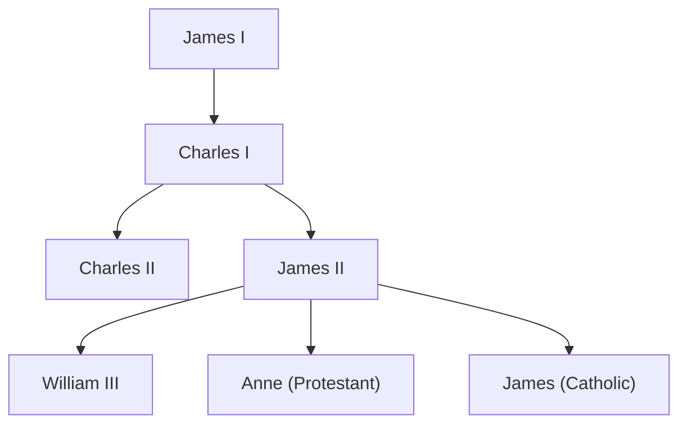

>[!info]- Notes
>
> - [[europe/Unit 3/Notes - Overview]]
> - [[europe/Unit 3/Notes - England]]
> - [[europe/Unit 3/Notes - French]]
> - [[europe/Unit 3/TBV 12 5]]
> - [[europe/Unit 3/Notes - Agricultural Revolution]]
> - [[europe/Unit 3/TBV 11 16]]
> - [[europe/Unit 3/Notes - Dutch Art]]
> - [[europe/Unit 3/Notes - French]]
> - [[europe/Unit 3/Notes - Enlightened Rulers]]
> - [[europe/Unit 3/Notes - Austria]]
> - [[europe/Unit 3/Notes - Catherine the Great]]
> - [[europe/Unit 3/TBV 11 4]]
## England

### Events
- [[cards/Gunpowder Plot]]
- [[cards/English Civil War]]
- [[cards/The Restoration]]
- [[cards/Glorious Revolution]]
### People
- [[cards/James I]] (r. 1603-1625)
- [[cards/Charles I]] (r. 1625-1649)
- [[cards/Charles II]] (r. 1660-1685)
- [[cards/James II]] (r. 1685-1688)

## France
### Events
- [[The Fronde]]
### People
- [[cards/Louis XIV]]
## Economy
### Events
- [[cards/Agricultural Revolution]]
### Concepts
- [[Mercantilism]]
## Dutch
- estates that represented 7 province each selected a **stadholder**; **oligarchy** system (ruling class)
- **Dutch East India Company**, a **joint-stock company** formed by Estates-General, promoted trade and bolstered Dutch economy
- religious tolerance for Catholics, Protestants, and Jews
