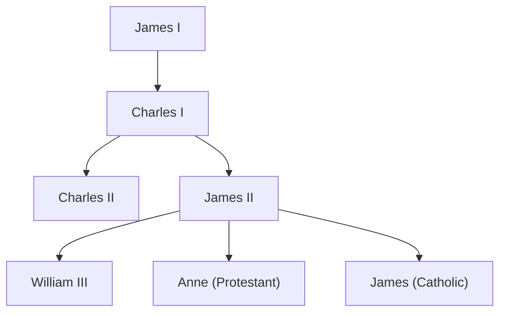

[[europe/Unit 3/Notes - Overview]]
## England
### Notes
- [[europe/Unit 3/Notes - England]]
### Events
- [[cards/Gunpowder Plot]]
- [[cards/English Civil War]]
- [[cards/The Restoration]]
- [[cards/Glorious Revolution]]
### People
- [[cards/James I]] (r. 1603-1625)
- [[cards/Charles I]] (r. 1625-1649)
- [[cards/Charles II]] (r. 1660-1685)
- [[cards/James II]] (r. 1685-1688)

## Economy
